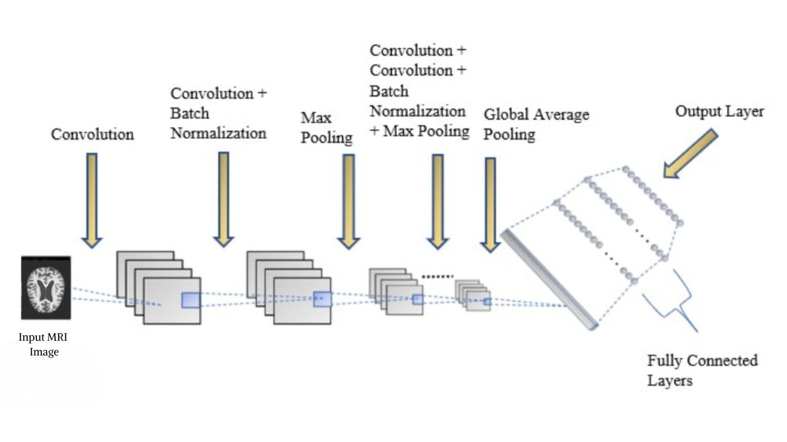

# Attention-Based Residual U-Net for Brain MRI Segmentation

Using a standard U-Net architecture with skip connections embedded in residual blocks and enriched with attention for creating a robust Deep Learning model for segmenting tumors in brain MRI scans.

## Sample Prediction Results on Unseen Data

## Running the app

- Firstly run <code>pip install -r requirements.txt</code> to install all dependencies.
- Then run <code>python app.py</code> to open the web app locally.

## Dataset

The dataset used for this project is taken from Kaggle (<a href = "https://www.kaggle.com/datasets/tourist55/alzheimers-dataset-4-class-of-images">dataset</a>).

The dataset consists of the following four classes of Alzheimer's MRI Images:

* Mild Demented
* Moderate Demented
* Non Demented
* Very Mild Demented

The dataset is comprised of around 6400 brain MRI Images.

## Network Architecture

The network architecture is illustrated below:

A series of convolutional layer – convolutional layer – batch normalization layer – max pooling layer is considered as a convolutional block. 
* Five such convolutional blocks are used and the number of filters of the Conv2D layers increases by the factor of 2 (ranging from 16 to 256) after each convolutional block.
* A 3x3 kernel and relu activation function is used for all the convolutional layers.
* Each maxpooling layer uses a pool size of 3x3 with a stride of 2.
* A dropout layer with a dropout rate of 0.2 is used after each convolutional block.
* The convolutional blocks are followed by a global average pooling layer and a couple of dense layers for classification.

## Tech Stack

* Tensorflow
* Keras
* Flask
* Docker
* HTML & CSS

## Demo on Heroku:
Mobile and PC users can find a prototype of this project on: <a href = "https://alzheimers-aaryan-nakhat.herokuapp.com/" target="_blank">Heroku</a>

(Note: the app takes time to load for the first time, so hang on!)

## Feedback

If you have any feedbacks or queries, feel free to reach me out at: aaryan.nakhat@gmail.com

If you would like to connect/collobrate with me, do ping me up on Linkedln: <a href = "https://www.linkedin.com/in/aaryan-nak" target="_blank">Aaryan Nakhat</a>

