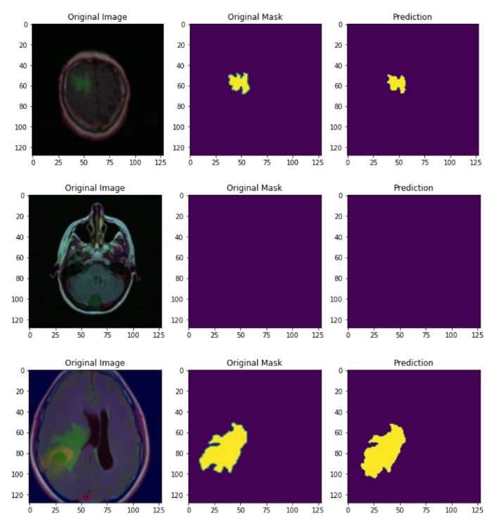

# Attention-Based Residual U-Net for Brain MRI Segmentation

Using a standard U-Net architecture with skip connections embedded in residual blocks and enriched with attention for creating a robust Deep Learning model for segmenting tumors in brain MRI scans.

## Sample Prediction Results on Unseen Data

## Dataset

The dataset used for this project is taken from Kaggle (<a href = "https://www.kaggle.com/datasets/mateuszbuda/lgg-mri-segmentation">dataset</a>).

The dataset consists of brain MR images together with manual FLAIR abnormality segmentation masks. The images were obtained from The Cancer Imaging Archive (TCIA).
The scans correspond to 110 patients included in The Cancer Genome Atlas (TCGA) lower-grade glioma collection. The dataset contains nearly 6400 brain MRI images.

## Network Architecture

* A series of convolutional layer – batch normalization layer - convolutional layer – batch normalization layer is considered as a conv_block. 
* A conv_block with skip connections called a res_conv_block is used. 
* An attention block is also used which basically takes 2 inputs: i) the gating signal which comes from a layer below the current layer in the decoder path, and ii) the input from the skip connection path going from the encoder to the decoder(as in traditional U-Net framework). After a series of computation followed by concatenation of these inputs, the resultant output from an attention block is a set of pixel-wise weights.
* A series of res_conv_block each followed by maxpooling layers is used in the encoder path.
* The decoder path consists of a bunch of attention blocks, res_conv_blocks, upsampling and concatenation layers.
* BinaryFocalLoss is used as the loss function and Adam is used as the optimizer.

## Tech Stack

* Tensorflow
* Keras
* OpenCV
* Pillow 

## Improvements

* Due to lack of computational resources, SeperableConv2D layers are used instead of the classic Conv2D layers. So using the later will help improve the performance further.
* Using a weighted sum of dice_loss and focal_loss tends to give far better results in biomedical segmentation tasks. Implementing the same should be beneficial.
* Increasing the batch_size, playing around with model hyperparameters and using larger size MRI scans can also help improve the IOU scores.

## Feedback

If you have any feedbacks or queries, feel free to reach me out at: aaryan.nakhat@gmail.com

If you would like to connect/collobrate with me, do ping me up on Linkedln: <a href = "https://www.linkedin.com/in/aaryan-nak" target="_blank">Aaryan Nakhat</a>

